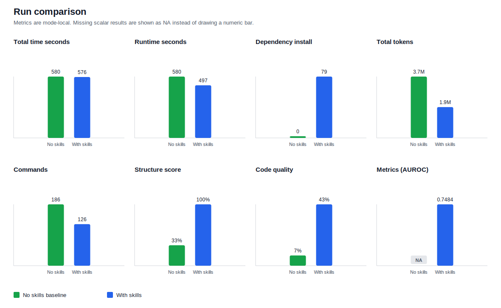

# Agent Skills Benchmark Harness

This harness runs agent CLIs in Docker and compares the same unstructured
job-conversion task **with and without an SDK's packaged agent skills** — measuring
whether those skills help an agent do the task better, and producing a **diagnostic
report that explains *why*** so the skills can be improved. The SDK is pluggable;
**NVFLARE is the default SDK** and the worked example throughout this guide.

> **Standalone, SDK-pluggable package.** This is a self-contained tool, independent of
> any individual SDK's build or release process. `bin/build.sh` / `bin/run.sh` work from
> any location; they only need to be pointed at an SDK source checkout (to build the SDK
> wheel + agent skills baked into the benchmark image) via `--sdk-repo PATH` or the
> `SDK_REPO` env var (autodetected from the current directory if omitted; the build fails
> fast if no SDK checkout can be found). Results are written under
> `<this-package>/results/` by default.

## Purpose

- **Question it answers** — do an SDK's packaged agent skills measurably improve an
  agent's performance on a real, unstructured conversion task, **and *why*?**
- **Method** — a controlled A/B on the same job, same agent, same prompt; only the
  skills differ (`without_skills` vs `with_skills`).
- **Output — a diagnostic, "why"-focused report, not a pass/fail score.** It compares the
  two runs across result correctness, generated-code structure, reported metrics, cost
  (time / tokens / commands), and failures — and, crucially, explains the *why* behind the
  differences: why one run was slower or spent more tokens, why a metric was missing or
  mismatched, why a job failed or needed repeated attempts. Those explanations are the
  **actionable clues for optimizing the skills** — what to add, tighten, or fix so the
  next iteration helps the agent more.
- **Not a runtime grader** — there is no hidden-oracle evaluator mode. The harness
  measures what the agent *does* and reports normalized evidence from the run.

## How it works

1. **Build** — bake the SDK wheel + the agent CLI into two images (skills off / on),
   recording the SDK's capture rules and identity in image metadata.
2. **Run a pair** — run the agent on the job in each image, in isolated containers;
   generic capture writes evidence (records, artifacts, agent events, workspace delta).
3. **Report** — resolve the SDK's report plugin by the captured identity and render the
   comparison report from typed evidence.

See [`docs/design/architecture.md`](docs/design/architecture.md) and the
[visual overview](docs/design/architecture_diagram.md) for the full design.

## Scope

- Agents: Codex and Claude. Claude uses the CLI default model unless `--model` is supplied.
- Modes: `without_skills` and `with_skills`.
- Job input: a folder containing scripts, data, docs, and any local requirements files.
- Prompt input: a local prompt file for direct runs, or a scenario prompt file/template.
- Scenario input: optional YAML compiled into `scenario.json` and `run_plan.json`.
- Results: written under `results/` by default.

## Quick Start

From anywhere, pointing at an SDK source checkout (e.g. NVFLARE):

```bash
./bin/build.sh --sdk-repo /path/to/NVFLARE
./bin/run.sh pair --sdk-repo /path/to/NVFLARE --prompt /path/to/prompt.txt /path/to/job-folder

# or set it once in the environment:
export SDK_REPO=/path/to/NVFLARE
./bin/build.sh
./bin/run.sh pair --prompt /path/to/prompt.txt /path/to/job-folder
```

Common pair command with a custom results root:

```bash
./bin/run.sh pair \
  --prompt /path/to/prompt.txt \
  /path/to/job-folder \
  --results-root /path/to/results
```

(Optional) install the harness package so `benchmark.harness` is importable
without `bin/*.sh` setting `PYTHONPATH`:

```bash
python3 -m pip install -e .
```

## Distribution

This tool is distributed as a **git repository you clone, configure, and run** —
not as a published wheel. `config/` (agent and SDK profiles) and `docker/` are
**user-owned configuration**, so they are deliberately kept editable in the
checkout rather than baked into a package. The workflow is: clone → edit config
under `config/` → `./bin/build.sh` / `./bin/run.sh`.

`pip install -e .` (above) is supported only as a convenience so `benchmark.harness`
imports without the `PYTHONPATH` shim; it does not bundle `config/`/`docker/` and
is not required. A distributable wheel would only make sense after splitting a
reusable engine (`benchmark.harness`) from user config supplied at runtime
(`--config-dir` / `SDK profile path`); that is a deliberate future step, and even
then the wheel would contain only `benchmark/`, never the config.

The paired run creates a timestamped result directory:

```text
results/<timestamp>/
|-- scenario.json
|-- run_plan.json
|-- scenario_summary.json
|-- reports/
|   |-- scenario_report.json
|   `-- scenario_report.md
|-- records/
|   `-- agent=.../model=.../workflow=.../job=.../mode=.../
```

Read `reports/scenario_report.md` first. It summarizes scenario status,
aggregate timing, quality-gate results, and the selected winner policy.

## Prerequisites

Install or configure these on the host:

- Docker.
- Python 3.
- `uv`, unless the SDK profile provides existing wheel files.
- Agent authentication for the selected agent (see below).

### Codex authentication

Provide either `~/.codex/auth.json` + `~/.codex/config.toml`, or an API key:

```bash
export OPENAI_API_KEY=...
./bin/run.sh pair --agent codex --prompt /path/to/prompt.txt /path/to/job-folder
```

### Claude authentication

The harness accepts any one of these — whichever is present is used:

| Method | How to provide |
| --- | --- |
| macOS Keychain | Run `claude login` once; `run.sh` reads the key automatically on macOS. |
| `ANTHROPIC_API_KEY` | `export ANTHROPIC_API_KEY=sk-ant-...` before running. |
| `ANTHROPIC_AUTH_TOKEN` | `export ANTHROPIC_AUTH_TOKEN=...` before running. |
| `ANTHROPIC_BASE_URL` proxy | `export ANTHROPIC_BASE_URL=https://... ANTHROPIC_API_KEY=...` before running. |
| `~/.claude/.credentials.json` | Created by `claude login` on non-macOS hosts. |

On macOS, `run.sh` automatically extracts `ANTHROPIC_API_KEY` from the
`"Claude Code"` Keychain entry when the environment variable is not already set.
No manual `export` is required if Claude Code has been authenticated at least
once on the host.

### Common options

To use a non-default agent home directory:

```bash
./bin/run.sh pair \
  --agent-home /path/to/agent-home \
  --prompt /path/to/prompt.txt \
  /path/to/job-folder
```

To disable host auth/config mounting entirely:

```bash
./bin/run.sh pair \
  --no-agent-auth-mount \
  --prompt /path/to/prompt.txt \
  /path/to/job-folder
```

## Build Images

Build the two Docker images:

```bash
cd /path/to/agent-skills-benchmark
./bin/build.sh
```

The build creates:

- `agent-skills-benchmark:codex-baseline`
- `agent-skills-benchmark:codex-skills`

Both images install the selected benchmark SDK from the SDK profile. The
default profile is `nvflare-profile`; the default agent profile is `codex`.
The baseline image uses the SDK profile's baseline wheel variant; the skills
image uses the skills wheel variant and runs the profile-declared skills
setup mode.

Select another supported agent profile:

```bash
./bin/build.sh --agent claude   # build Claude images
./bin/build.sh --agent codex    # build Codex images (default)
```

Use a custom profile file:

```bash
./bin/build.sh \
  --sdk-profile /path/to/sdk-profile.yaml \
  --agent /path/to/agent-profile.yaml
```

For a repo-backed SDK build, set the SDK profile source:

```yaml
source:
  type: repo
  path: /path/to/sdk-checkout
  markers:
    - pyproject.toml
build:
  type: uv_wheel
```

For `build.type: uv_wheel`, the build **reuses an existing SDK wheel** from the
repo's `dist/` when one is present, and only runs `uv build` when no wheel is
found. Pass `--rebuild` to force a fresh wheel build:

```bash
./bin/build.sh --rebuild --sdk-repo /path/to/sdk-checkout
```

When a profile has no build-time variant toggle and both variants use the same
wheel selectors, the harness builds or reuses one repo wheel and stages those
exact bytes into both image variants.

For wheel-provided SDK images, set `source.type: wheels` and
`build.type: provided_wheels`. In this mode `build.sh` stages the listed wheels
and does not need the SDK repo or `uv`:

```yaml
source:
  type: wheels
  wheels:
    skills: /path/to/sdk-with-skills.whl
    baseline: /path/to/sdk-baseline.whl
build:
  type: provided_wheels
```

SDK skills setup is explicit in the same profile. Use `command` when the SDK
has a CLI installer:

```yaml
skills:
  setup:
    type: command
    install_command: sdk-cli skills install --agent "${BENCHMARK_DOCKER_AGENT}" --target "${BENCHMARK_AGENT_HOME}/skills"
    list_command: sdk-cli skills list --agent "${BENCHMARK_DOCKER_AGENT}" --target "${BENCHMARK_AGENT_HOME}/skills"
```

Use `copy` when the SDK provides a skills folder directly. `build.sh` stages
that folder into the Docker build context, and the image copies it into the
selected agent profile home under `skills/`:

```yaml
skills:
  setup:
    type: copy
    source_path: /path/to/sdk/agent-skills
    expected_source: profile_skills_folder
```

Agent CLI versions and image names live in the agent profile:

```yaml
images:
  skills: agent-skills-benchmark:{agent}-skills
  baseline: agent-skills-benchmark:{agent}-baseline
  report: agent-skills-benchmark:{agent}-skills

build:
  args:
    BENCHMARK_DOCKER_AGENT: codex
    BENCHMARK_AGENT_HOME: /workspace/.codex
    AGENT_CLI_NAME: codex
    AGENT_INSTALL_COMMAND: npm install -g "@openai/codex@0.137.0"
    AGENT_VERSION_COMMAND: codex --version
```

Useful build flags:

```bash
./bin/build.sh --no-cache
./bin/build.sh --skip-baseline-image
./bin/build.sh --skip-skills-image
./bin/build.sh --node-image node:22.16.0-bookworm-slim
./bin/build.sh --uv-image ghcr.io/astral-sh/uv:0.11.19
./bin/build.sh --rebuild         # force a fresh uv build of the SDK wheel
```

For `build.type: uv_wheel` (repo source), the build reuses the most recently
built wheel in the SDK repo's `dist/` by default and only runs `uv build` when
none is found. Pass `--rebuild` to force a fresh build — e.g. after the SDK
source has changed. Profiles without a build-time variant toggle stage the same
repo wheel bytes into both image variants. (`build.type: provided_wheels`
profiles always stage the wheels listed in the profile and ignore `--rebuild`.)

Verify the images exist:

```bash
docker image ls 'agent-skills-benchmark'
```

Verify the default NVFlare SDK and installed skills in the skills image
(skills are installed by the Agent Skills CLI at build; the harness's generic
lister records them in the agent home's `skills_list.json`):

```bash
# Codex
docker run --rm agent-skills-benchmark:codex-skills \
  /bin/bash -lc 'nvflare --version; ls /workspace/.codex/skills; cat /workspace/.codex/skills_list.json'

# Claude
docker run --rm agent-skills-benchmark:claude-skills \
  /bin/bash -lc 'nvflare --version; ls /workspace/.claude/skills; cat /workspace/.claude/skills_list.json'
```

The images do not install job-specific training dependencies: the container
prewarms the job folder's own `requirements*.txt` identically in both modes
before the measured agent phase.

## Add Another SDK

Add one SDK profile file:

```text
config/sdks/<sdk-profile>.yaml
```

The YAML declares the SDK package/import names, source, skills and baseline
wheel variants, and `skills.setup`. `build.type: uv_wheel` builds wheels from a
repo source. `build.type: provided_wheels` stages the exact wheel paths from a
wheels source and skips SDK building. `skills.setup.type` must be `command`,
`copy`, or `none`.
Then build with:

```bash
./bin/build.sh --sdk-profile <sdk-profile>
```

Evaluation criteria are build inputs. Prefer an SDK-profile path relative to
the checkout supplied by `--sdk-repo`:

```yaml
evaluation:
  criteria_path: path/inside/sdk/repo/evaluation
```

The path may identify one self-contained YAML file, a composed rules directory
containing `index.yaml` (or `<sdk>/index.yaml`), or an SDK-native criteria
directory when the harness knows how to convert it. The default NVFLARE profile
uses `dev_tools/agent/skill_evals`; build preparation converts those
`*/evals.json` files into a captured harness rules bundle and keeps the source
JSON alongside it for audit. Override or supply the input directly when the SDK
profile has no repo-relative path:

```bash
./bin/build.sh \
  --sdk-repo /path/to/sdk \
  --evaluation-criteria /path/to/evaluation-rules
```

The build validates and hashes the resolved criteria, bakes them into both
runtime images, and each run captures the bundle under `evaluation_rules/`.
Report replay uses that captured copy rather than rereading the live SDK repo.

Run the benchmark tests after adding the plugin:

```bash
python -m pytest tests/unit_test/skills_benchmark
```

## Prompt Inputs

The prompt is not committed to git and is not baked into Docker images. Pass it
at run time for direct `pair`, `one`, and `interactive` runs:

```bash
./bin/run.sh pair --prompt ./prompt.txt /path/to/job-folder
```

Inside the container:

- The job folder is mounted read-only at `/workspace/input`.
- The prompt file is mounted read-only at
  `/workspace/prompts/benchmark_prompt.txt`.
- The result directory is mounted at `/workspace/results`.

The harness copies the prompt verbatim. It does not append mode names, workflow
instructions, record paths, or skill instructions. The prompt should describe
the conversion task and ask the agent to report final artifacts, validation
steps, and any validation metric requested by the job documentation.

Scenario YAML may also use prompt templates:

```yaml
prompt:
  path: prompt_template.txt
  variables:
    job_name: ames
```

Only explicitly declared scalar variables are substituted. Missing variables,
unused variables, attribute/index access, and format conversions fail scenario
validation. Template variables do not authorize hidden mode, workflow, metric,
record-path, or skill-hint injection. Compared mode legs receive identical
rendered prompt bytes, and rendered prompts are materialized under the result
root, not in the scenario source directory.

Example prompt:

```text
Convert the training job in /workspace/input into a NVFLARE job.
Use the workflow requested by the job documentation when it is clear.
Install job dependencies from requirements files when needed.
Run cheap validation before full simulation, then report final artifact paths
and validation metrics.
```

## Run A Pair

Run both modes sequentially:

```bash
./bin/run.sh pair --prompt ./prompt.txt /path/to/job-folder
```

Equivalent explicit job-folder option:

```bash
./bin/run.sh pair --prompt ./prompt.txt --training-code /path/to/job-folder
```

Set the parent directory for timestamped results:

```bash
./bin/run.sh pair \
  --prompt ./prompt.txt \
  /path/to/job-folder \
  --results-root /path/to/results
```

The positional job folder and trailing options can be combined in the same
style used for local NVFLARE benchmark fixtures:

```bash
./bin/run.sh pair \
  --prompt /path/to/prompt.txt \
  /path/to/job-folder \
  --results-root /path/to/results
```

Write a comparison to an exact directory:

```bash
./bin/run.sh pair \
  --prompt ./prompt.txt \
  --output-dir /path/to/exact-result-dir \
  /path/to/job-folder
```

Select a Codex model:

```bash
./bin/run.sh pair \
  --model <model-name> \
  --prompt ./prompt.txt \
  /path/to/job-folder
```

Select Claude:

```bash
./bin/run.sh pair \
  --agent claude \
  --model <model-name> \
  --prompt ./prompt.txt \
  /path/to/job-folder
```

`--agent` defaults to `codex`. Known-pending agents (`hermes`, `openclaw`) are
registered in the registry but have no adapter or config yet; they fail during
build/run preflight with an explicit message.

`pair` is a shortcut over the scenario/run-plan execution path. It writes the
same canonical scenario records as `scenario`.

## Run A Scenario

Scenario YAML files describe agents, models, workflows, jobs, and comparison
type. The harness compiles them into `scenario.json` and `run_plan.json`
before Docker execution:

```bash
./bin/run.sh scenario /path/to/scenario.yaml --output-dir /path/to/result-root
```

Minimal skills-vs-baseline scenario:

```yaml
name: ames mode ablation

prompt: ./prompt.txt
fail_fast: false

agents:
  - name: codex
    models:
      - "<model-name>"

workflows:
  - name: fedavg

jobs:
  - name: ames
    path: /path/to/job-folder
    scale: small

comparison:
  type: mode_ablation
  modes:
    - without_skills
    - with_skills
```

For Claude, set `agents[0].name` to `claude` and provide a model. For a model
comparison, keep one agent and use `comparison.type: model_comparison` with a
`comparison.models` list.

Save the YAML above as a local scenario file, edit `prompt` and `jobs[].path`,
then pass it to `scenario`.

The scenario command writes:

```text
result-root/
|-- scenario.json
|-- run_plan.json
|-- scenario_summary.json
|-- reports/
|   |-- scenario_report.json
|   `-- scenario_report.md
`-- records/
    `-- agent=<agent>/model=<model>/workflow=<workflow>/job=<job>/mode=<mode>/
```

Each mode directory contains direct canonical artifacts such as
`record_summary.json`, `agent_events.jsonl`, `agent_usage.json`,
`agent_activity.json`, `agent_last_message.txt`, `agent_stderr.txt`,
`agent_record.json`, and `benchmark_record.json`.

When an otherwise unspecified Codex model is recovered from the session
rollout created by that invocation, the directory also contains
`agent_session_evidence.json`. This is a minimal identity record; the harness
does not retain the complete Codex session rollout.

## Regenerate Reports

Use `report` to regenerate parser artifacts, scenario
summaries, and scenario reports from an existing result root without invoking a
live agent or Docker:

```bash
./bin/run.sh report /path/to/result-root
```

`report` requires a `run_plan.json` in the result root and captured
`agent_events.jsonl` files under the canonical records tree.

## Interactive Container

Use `interactive` to inspect the runtime image, auth mounts, or job input:

```bash
./bin/run.sh interactive --prompt ./prompt.txt /path/to/job-folder
```

Useful checks inside the container:

```bash
python --version
uv --version
nvflare --version
nvflare agent info --format json
ls /workspace/.codex/skills   # installed skills (skills image)
ls -la /workspace/input
ls -la /workspace/prompts
```

## Result Layout

Each scenario mode directory contains the normalized run artifacts:

```text
records/agent=<agent>/model=<model>/workflow=<workflow>/job=<job>/mode=with_skills/
|-- agent_activity.json
|-- agent_events.jsonl
|-- agent_record.json
|-- agent_last_message.txt
|-- agent_session_evidence.json  # only when model source is agent_session
|-- agent_stderr.txt
|-- agent_usage.json
|-- benchmark_record.json
|-- container_exit_code.json
|-- evaluation_rules/
|-- prompt.txt
|-- prompt_metadata.json
|-- records/
|   |-- with_skills_agent_record.json
|   `-- with_skills_record.json
|-- record_summary.json
|-- run_summary.json
|-- timing.json
|-- workspace_delta/
`-- workspace_delta_manifest.json
```

`without_skills` has the same shape with `without_skills` record names.

The paired result root contains canonical scenario files:

```text
results/<timestamp>/
|-- console_output.log
|-- host_report_status.json
|-- scenario.json
|-- run_plan.json
|-- scenario_summary.json
|-- reports/
|   |-- scenario_report.json
|   `-- scenario_report.md
`-- records/
```

For Codex compatibility, the harness also writes aliases such as
`codex_events.jsonl`, `codex_usage.json`, and `codex_last_message.txt`.

## Reading Results

Start with these files:

- `reports/scenario_report.md`: human-readable scenario status, aggregate
  results, quality-gate status, and winner policy.
- `scenario_summary.json`: machine-readable scenario, comparison, and aggregate
  summaries.
- `records/.../mode=<mode>/record_summary.json`: normalized per-run metrics,
  exit codes, prompt hash, and quality signals.
- `records/.../mode=<mode>/agent_last_message.txt`: final agent response.
- `records/.../mode=<mode>/agent_stderr.txt`: agent stderr.
- `records/.../mode=<mode>/workspace_delta/`: generated files retained for
  review.
- `console_output.log`: complete host-side console log for paired runs.

When a case fails, look for:

- `records/.../mode=<mode>/early_failure.json`
- `records/.../mode=<mode>/late_harness_failure.json`
- `records/.../mode=<mode>/container_exit_code.json`
- `records/.../mode=<mode>/agent_stderr.txt`
- `records/.../mode=<mode>/agent_last_message.txt`

## Example Report

A paired benchmark run writes a compact status view, detailed diagnostic
evidence, numeric comparison, and machine-readable artifacts. The generated
reports are organized around these areas:

| Report area | Sections | What it includes |
| --- | --- | --- |
| **Run overview** | **Run Identity**, **Aggregate Results**, **Winner Policy**, **Executive Summary** | Run labels, agent/model identity, pass counts, selected winner policy, overall status, job execution status, FL workflow, quality gate status, metric gaps, and captured artifacts. |
| **Execution evidence** | **FL Algorithm / Workflow**, **Failure Analysis**, **Missing, Partial, Or Mismatched Result Metrics** | Detected workflow/recipe/rounds, recovered failures, root-cause evidence, dependency evidence, and whether expected validation metrics were usable. |
| **Metric comparison** | **Metrics**, **Quality Signals**, **Comparison** | SVG charts and tables for time, tokens, commands, structure score, code quality, validation metrics, expected-vs-reported metric evidence, and numeric deltas between modes. |
| **Output and structure** | **Output Changes**, **Outcome Details**, **Structure Correctness**, **Captured Structure Trees** | Changed/generated file counts, notable files, quality gate result, required files, optional helpers, workspace inventories, runtime artifact inventories, and final-workspace tree snapshots. |
| **Generated code signals** | **Generated Code Quality Signals** | Data split behavior, lifecycle patterns, metric workload, observability, output locality, dependency strategy, and API pattern evidence. |
| **Agent activity** | **Activity Insights**, **Event Mix** | File reads, discovery/search commands, simulation references, compile checks, skill references, job entry-point usage, and captured event-type counts. |
| **Cost and explanation** | **Cost And Work Comparison**, **Why**, **Interpretation** | Total time, runtime seconds, dependency-install seconds, non-install command seconds, tokens, commands, unique commands, slowdown drivers, elapsed-time accounting, longest commands, runtime path differences, runtime winner, token-use winner, and cost-comparison caveats. |
| **Retained artifacts** | **Artifacts** | Pointers to generated reports and retained records for deeper inspection. |

The generated metrics report includes an SVG chart and an HTML version renders
the chart directly. This README excerpt uses a checked-in SVG asset so the
chart renders in GitHub Markdown.

The excerpt below shows only the metrics section, not the full generated
report.

### Metrics Excerpt



| Metric | No skills baseline | With skills |
|---|---|---|
| Metrics (AUROC) | AUROC NA | AUROC 0.7484 |

## Configuration Inputs

Use CLI flags for normal runs:

| Input | Purpose |
| --- | --- |
| `--agent` | Agent profile to run. Defaults to `codex`. |
| `--model` | Agent model to run. Required for agents without a default model. |
| `--workflow` | Workflow label written into scenario records. Defaults to `default`. |
| `--job-scale` | Resource policy size for direct `pair` runs: `small`, `medium`, or `large`. |
| `--agent-home` | Host auth/config directory for the selected agent. Defaults come from the agent profile. |
| `--no-agent-auth-mount` | Disable mounting host auth/config files for the selected agent. |
| `--results-root` | Parent directory for timestamped result directories. |
| `--output-dir` | Exact output directory for this run or comparison. |
| `--sdk-profile` | SDK build profile for `bin/build.sh`. Defaults to `nvflare-profile`. |
| `--agent` | Agent profile name or YAML path for `bin/build.sh`. Defaults to `codex`. Also accepted as `--agent-profile`. |
| `--sdk-repo` | SDK source checkout used for wheel builds and repo-relative evaluation criteria. |
| `--evaluation-criteria` | Explicit evaluation criteria path; accepts harness YAML/rules directories and supported SDK-native layouts, overriding the SDK-profile repo path. |

Use environment variables only for provider-native credentials or compatibility
with older scripts:

| Variable | Purpose |
| --- | --- |
| `OPENAI_API_KEY` | Optional Codex API key passed through to the container. |
| `ANTHROPIC_API_KEY` | Optional Claude API key passed through to the container. |
| `ANTHROPIC_AUTH_TOKEN` | Optional Claude bearer token passed through to the container. |
| `ANTHROPIC_BASE_URL` | Optional Claude API base URL (proxy/gateway) passed through to the container. |

Compatibility fallbacks such as `BENCHMARK_AGENT`, `BENCHMARK_AGENT_MODEL`,
`MODE`, `JOB_INPUT_DIR`, `TRAINING_CODE`, `RESULT_ROOT`, and `RESULT_DIR` still
exist for existing automation. Prefer the CLI flags above for new usage.
New agent profiles should add provider-native credential passthrough names only
when the agent CLI requires them; they should not introduce new harness
variables for auth directory or auth mounting.

## Troubleshooting

Missing Docker images:

```text
Benchmark Docker image(s) are missing locally
```

Run:

```bash
./bin/build.sh
docker image ls 'agent-skills-benchmark'
```

Prompt missing:

```text
Prompt file is required
```

Create a local prompt file and pass `--prompt /path/to/prompt.txt`. The harness
does not use a repository prompt by default.

Unsupported model:

```text
The '<model>' model is not supported
```

Pass `--model` with a model available to the account used by the selected
agent.

Auth missing (Codex):

```text
Codex auth not mounted
Codex config not mounted
```

Check `--agent-home`, `~/.codex/auth.json`, and `~/.codex/config.toml`, or set
`OPENAI_API_KEY`. Use `interactive` to inspect the container environment.

Auth missing (Claude):

```text
Not logged in · Please run /login
```

On macOS, `run.sh` reads the API key from the `"Claude Code"` Keychain entry
automatically — ensure Claude Code has been authenticated on this host at least
once (`claude login`). On other platforms, set `ANTHROPIC_API_KEY`,
`ANTHROPIC_AUTH_TOKEN`, or ensure `~/.claude/.credentials.json` exists. Use
`--no-agent-auth-mount` combined with an exported `ANTHROPIC_API_KEY` to skip
file mounting entirely.

No report generated:

Check these files in the result root:

- `host_report_status.json`
- `console_output.log`

No validation metric in reports:

The report extracts metrics from agent evidence. If the agent final message or
record does not expose the requested scalar metric, the report shows `NA`
instead of inventing a value.

Slow skills run:

Compare `phase_seconds.agent_elapsed_seconds`, `activity.command_count`,
`activity.command_prefix_counts`, and `activity.hint_counts` in each
`run_summary.json`. Skill installation happens at image-build time, not during
the measured agent run.

Job dependency failure:

Inspect `records/.../mode=<mode>/agent_last_message.txt`,
`records/.../mode=<mode>/agent_stderr.txt`, and
`records/.../mode=<mode>/workspace_delta/`. The prompt should instruct the
agent to install job dependencies from available requirements files when needed.

## Harness Modules

- `bin/build.sh`: thin wrapper around `benchmark.harness.host.build`.
- `bin/run.sh`: thin wrapper around `benchmark.harness.host.runner`.
- `docker/Dockerfile`: runtime image with the selected agent CLI and SDK wheel.
- `config/agents/`: built-in editable agent CLI configs.
- `config/sdks/`: built-in editable SDK build/install configs.
- `benchmark/harness/scenarios.py`: scenario validation, run-plan expansion, and
  scenario reports.
- `benchmark/harness/host/`: Docker orchestration, path handling, image selection, and
  scenario execution.
- `benchmark/harness/container/`: in-container agent execution and artifact capture.
- `benchmark/harness/sdks/`: SDK config loader and adapter interfaces.
- `benchmark/harness/artifacts.py`, `events.py`, `records.py`, `timing.py`, and
  `quality_signals.py`: normalized measurement semantics.
- `benchmark/harness/reports/`: scenario report helpers and structure rendering.

## Current Limits

- Codex and Claude adapters are implemented. `hermes` and `openclaw` are
  registered as known-pending adapters with no config or Docker support yet.
- Benchmark containers run as a non-root user (`uid=9999`). Agent CLIs that
  require root will fail; agent CLIs that block root (e.g. Claude Code
  `--dangerously-skip-permissions`) work correctly.
- The harness does not require or validate a structured job schema.
- The harness does not infer a framework or workflow from the job folder. The
  prompt and job documentation define the requested task.
