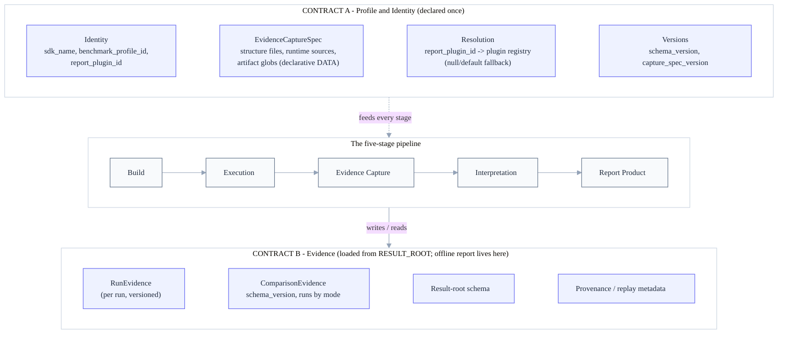
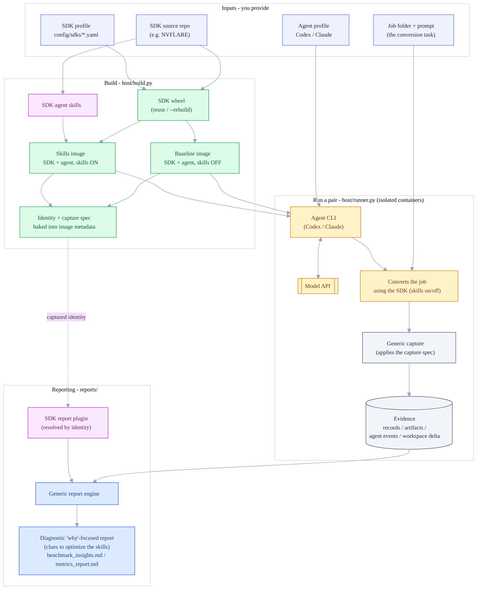
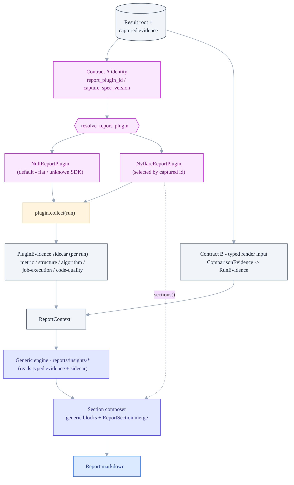
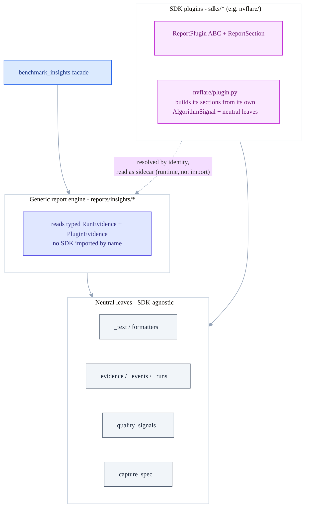

# Architecture — visual overview

Companion to [`architecture.md`](architecture.md). Diagrams of the major system
components (the build → run → report pipeline) and the key design components (the
SDK plugin seam, the two contracts, and how a new SDK plugs in without engine changes).

> Rendered with Mermaid — GitHub renders fenced `mermaid` code blocks natively.

---

## 1. Conceptual overview — two contracts around a five-stage pipeline

The architecture's center of gravity is **two contracts** bracketing the pipeline.
**Contract A (Profile & Identity)** is declared once and consumed by every stage; the
**five stages** run Build → Execution → Evidence Capture → Interpretation → Report;
**Contract B (Evidence)** is what Capture *writes* and Interpretation *reads* — the stable
replay/report boundary, so the report can be regenerated offline from a result root.
(This is the Mermaid form of the ASCII diagram in
[`architecture.md`](architecture.md), "Architecture overview".)

Contract A is consumed per stage: **Identity** is baked in at Build and resolves the
plugin at Interpretation; the **EvidenceCaptureSpec** is applied generically at Evidence
Capture. Evidence Capture **writes** Contract B and Interpretation **reads** it.

---

## 2. System components & data flow

The benchmark answers one question: **do an SDK's agent skills make an agent do a real
conversion task better?** You supply the SDK, an agent, and a job; the framework builds
two images (skills off / on), runs the agent in each, captures evidence, and reports the
comparison.

---

## 3. The SDK plugin seam

The report engine is **generic**. All SDK-specific meaning — vocabulary, metric
assessment, whole sections — comes from a **report plugin** resolved by the *captured
identity*, and is read as a per-run **sidecar**; the engine never calls the SDK by name.

**Plugin hooks** (`sdks/report_plugin.py`): `collect` → `PluginEvidence`;
`participant_model` (e.g. site/server vs worker/coordinator vocabulary); `assess_metric`;
`score_structure`; `detect_sdk_activity`; `explain` (narrative fragments); `sections`
(`ReportSection`, insert-only composition); `section_copy` (bounded vocabulary embedded
inside generic sections); `metric_log_patterns`.

---

## 4. How a new SDK plugs in without changing the engine

The load-bearing rule: both the report engine and the SDK plugins depend only on shared,
SDK-agnostic helpers, and **the engine and an SDK plugin never import each other by name**.
That is what lets a new SDK be added without touching the engine.

**Forbidden edges (guarded by tests):** no `sdks/*` → `reports/insights/*` or
`benchmark_insights` import (a plugin never imports the engine), and no
`reports/insights/*` → SDK-by-name import (the engine never names an SDK at module load).

---

## Three core design principles

| Principle | What it means |
|---|---|
| **Typed evidence is the render input** | the engine renders from one typed evidence object (`RunEvidence`), never from raw dicts |
| **Meaning lives in the plugin** | SDK vocabulary, metric assessment, and section content come from the plugin, not the engine |
| **The default is neutral** | with no SDK identity the report uses a neutral (`Null`) plugin; a specific SDK is selected only by the *captured identity* |

Capture is **declarative data** (the capture spec, applied by generic in-container code);
interpretation is **code** (the report plugin). See [`architecture.md`](architecture.md)
for the full narrative and section-level detail.
