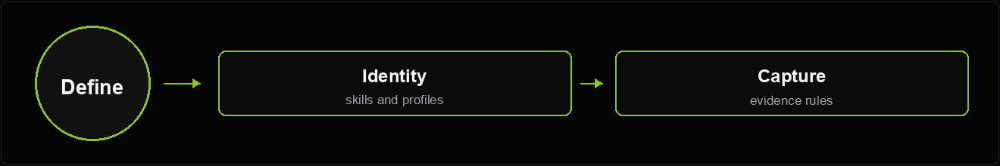
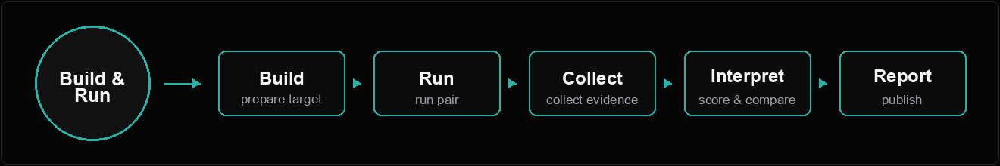
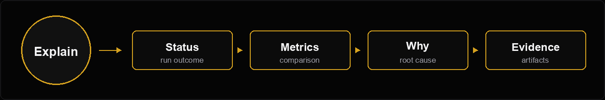

<section class="bench-hero">
  <p class="bench-kicker">SDK-pluggable agent evaluation</p>
  <h1>Agent Skills Benchmark</h1>
  <p class="bench-lede">
    Run the same real SDK conversion task with and without packaged agent skills,
    then inspect the evidence-backed report that explains what changed and why.
  </p>
  <div class="bench-actions">
    <a class="md-button md-button--primary" href="#quick-start">Run a pair</a>
    <a class="md-button" href="#architecture">Read the architecture</a>
  </div>
</section>

<div class="bench-stat-row">
  <div class="bench-stat">
    <span>Comparison</span>
    <strong>with_skills vs without_skills</strong>
  </div>
  <div class="bench-stat">
    <span>Default SDK</span>
    <strong>NVFLARE</strong>
  </div>
  <div class="bench-stat">
    <span>Agents</span>
    <strong>Codex and Claude</strong>
  </div>
  <div class="bench-stat">
    <span>Output</span>
    <strong>Why-focused report</strong>
  </div>
</div>

## How it works

The harness builds two runtime images, runs the same prompt and job in isolated
containers, captures evidence from both runs, and renders a diagnostic report
from disk. The report is not based on the agent's self-report alone; it reads
the result root, runtime artifacts, event logs, workspace delta, and SDK-specific
sidecars.

<figure class="bench-lane-stack" aria-label="Benchmark harness flow">
  
  
  
</figure>

## Quick Start

<div class="bench-command-grid">
  <section class="bench-command-card">
    <p class="bench-layer-kicker">Default agent</p>
    <h3>Build and run Codex</h3>

```bash
./bin/build.sh --sdk-repo /path/to/sdk-repo --agent codex

./bin/run.sh pair \
  --sdk-repo /path/to/sdk-repo \
  --prompt /path/to/prompt.txt \
  /path/to/job-folder
```

  </section>
  <section class="bench-command-card">
    <p class="bench-layer-kicker">Custom output</p>
    <h3>Run Claude with a results root</h3>

```bash
./bin/build.sh --sdk-repo /path/to/sdk-repo --agent claude

./bin/run.sh pair \
  --sdk-repo /path/to/sdk-repo \
  --agent claude \
  --prompt /path/to/prompt.txt \
  /path/to/job-folder \
  --results-root /path/to/results
```

  </section>
</div>

## Why this benchmark exists

<div class="bench-grid">
  <section class="bench-card">
    <h3>Measure skill impact</h3>
    <p>
      Compare the same agent, model, prompt, and job with only one variable:
      whether SDK skills are available.
    </p>
  </section>
  <section class="bench-card">
    <h3>Explain the result</h3>
    <p>
      Report generation traces failures, missing metrics, dependency work,
      generated-code structure, tokens, commands, and runtime artifacts.
    </p>
  </section>
  <section class="bench-card">
    <h3>Improve the skills</h3>
    <p>
      The output is designed to show what the skill instructions should tighten,
      clarify, or avoid in the next iteration.
    </p>
  </section>
  <section class="bench-card">
    <h3>Replay from evidence</h3>
    <p>
      Existing result roots can be reported again offline, without rerunning the
      agent or rebuilding Docker images.
    </p>
  </section>
</div>

## Evidence-first reporting

The report pipeline separates execution from judgment. Agent text is still
checked for instruction following, but the source of truth is the captured
workspace and runtime evidence.

| Signal | Source of truth | Why it matters |
| --- | --- | --- |
| Job lifecycle | Runtime logs and summary artifacts | Distinguishes completed jobs from partial or killed simulations. |
| Metrics | `metrics_summary.json` and captured metric artifacts | Prevents a final message from inventing or omitting key values. |
| Code quality | Workspace delta and SDK plugin checks | Shows whether the generated job uses the expected SDK pattern. |
| Cost | Event logs, command activity, token usage | Explains why one run spent more time, commands, or model budget. |

<section class="bench-scorecard" aria-label="Example report comparison">
  <div class="bench-scorecard-head">
    <p class="bench-layer-kicker">Report snapshot</p>
    <h3>Comparison scorecard</h3>
    <p>One table keeps the benchmark result scannable: each metric shows both modes, the difference, and whether evidence was missing.</p>
  </div>
  <div class="bench-score-row bench-score-row-head">
    <span>Metric</span>
    <span>No skills</span>
    <span>With skills</span>
    <span>Delta</span>
  </div>
  <div class="bench-score-row">
    <span>Runtime</span>
    <strong>580s</strong>
    <strong>497s</strong>
    <em class="bench-score-good">-14%</em>
  </div>
  <div class="bench-score-row">
    <span>Total tokens</span>
    <strong>3.7M</strong>
    <strong>1.9M</strong>
    <em class="bench-score-good">-49%</em>
  </div>
  <div class="bench-score-row">
    <span>Commands</span>
    <strong>186</strong>
    <strong>126</strong>
    <em class="bench-score-good">-32%</em>
  </div>
  <div class="bench-score-row">
    <span>Structure score</span>
    <strong>33%</strong>
    <strong>100%</strong>
    <em class="bench-score-better">+67 pts</em>
  </div>
  <div class="bench-score-row">
    <span>Code quality</span>
    <strong>7%</strong>
    <strong>43%</strong>
    <em class="bench-score-better">+36 pts</em>
  </div>
  <div class="bench-score-row">
    <span>Result metric</span>
    <strong>AUROC NA</strong>
    <strong>AUROC 0.7484</strong>
    <em class="bench-score-warn">baseline missing</em>
  </div>
</section>

## Report layers

The report is split into a generic SDK reporting layer and an SDK-specific
interpretation layer. The generic layer stays reusable for any SDK benchmark;
the FLARE layer adds NVFLARE semantics only when the captured profile selects
that plugin.

<div class="bench-layer-grid">
  <section class="bench-layer bench-layer-generic">
    <p class="bench-layer-kicker">Generic SDK report</p>
    <h3>Reusable comparison engine</h3>
    <ul>
      <li>Run identity, host OS, agent, model, and mode.</li>
      <li>Quality gate status, elapsed time, tokens, commands, and costs.</li>
      <li>Captured artifacts, workspace delta, metric extraction, and replay.</li>
      <li>Generic why analysis for time, dependency installs, and activity.</li>
    </ul>
  </section>
  <section class="bench-layer bench-layer-flare">
    <p class="bench-layer-kicker">FLARE SDK reporting</p>
    <h3>NVFLARE interpretation plugin</h3>
    <ul>
      <li>FL job lifecycle: simulation started, completed, stalled, or killed.</li>
      <li>FL algorithm and recipe checks, including FedAvg/SCAFFOLD evidence.</li>
      <li>Site/client metrics, FL-level scalar selection, and runtime log recovery.</li>
      <li>NVFLARE job structure and generated code quality checks.</li>
    </ul>
  </section>
</div>

## Run evidence flow

The benchmark compares controlled runs. Each mode has its own container,
workspace, agent event stream, and captured artifacts; the result root is the
shared ledger that the generic report reads after both runs finish. SDK-specific
reporting is applied afterward from the captured profile id.

<div class="bench-network" aria-label="Run evidence flow diagram">
  <div class="bench-node bench-node-host">Host runner</div>
  <div class="bench-network-row">
    <div class="bench-node bench-node-mode">
      <span>without_skills</span>
      <strong>events, logs, workspace delta</strong>
    </div>
    <div class="bench-node bench-node-mode">
      <span>with_skills</span>
      <strong>events, logs, workspace delta</strong>
    </div>
  </div>
  <div class="bench-node bench-node-data">timestamped result root</div>
  <div class="bench-network-row">
    <div class="bench-node bench-node-report">generic SDK report</div>
    <div class="bench-node bench-node-sdk-report">FLARE SDK report plugin</div>
  </div>
  <div class="bench-node bench-node-output">scenario_report.md</div>
</div>

## Architecture

The design has two contracts around a five-stage pipeline:

1. Profile and identity: SDK name, report plugin id, capture spec, and versions.
2. Evidence: typed run/comparison evidence loaded from the result root.
3. Pipeline: build, execution, capture, interpretation, and report product.

The canonical design notes live in the repository root under
`docs/design/architecture.md` and `docs/design/architecture_diagram.md`.
